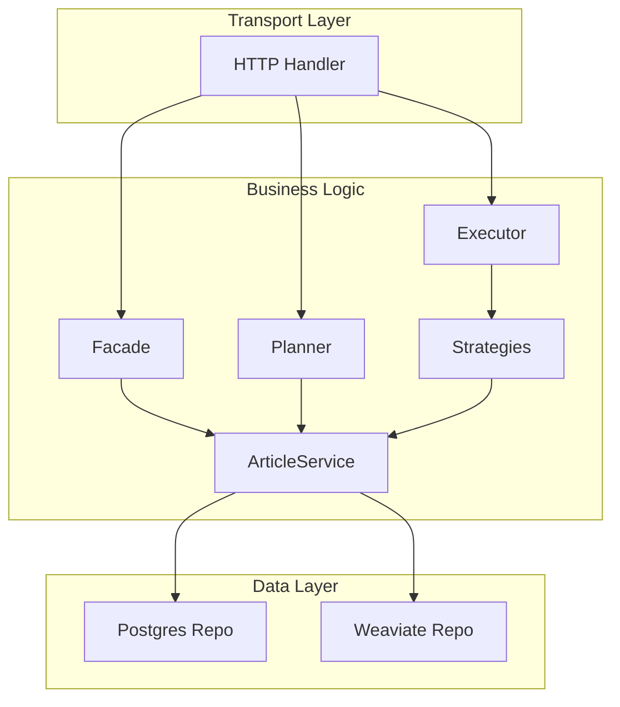

# Article Chat System

[](https://goreportcard.com/report/github.com/innadav/article-chat-system)
[](https://opensource.org/licenses/MIT)

An intelligent, chat-based service built in Go that allows users to interact with a persistent collection of articles. The system leverages Large Language Models (LLMs) and a vector database to provide summarization, sentiment analysis, and complex, context-aware query responses.

## ✨ Features

  * **Natural Language Chat Interface**: Ask questions in plain English via a simple REST API.
  * **Dynamic Article Ingestion**: Add new articles to the system at any time by providing a URL.
  * **Advanced Query Capabilities**:
      * Summarization, keyword/entity extraction, and sentiment analysis.
      * Comparative analysis (tone, positivity) between multiple articles.
      * Semantic topic search that understands the *meaning* of your query.
  * **Persistent Storage**: Article metadata is stored in PostgreSQL, and semantic vectors are stored in Weaviate.
  * **Observability**: Full support for structured logging (`slog`) and distributed tracing (`OpenTelemetry` + `Jaeger`) for LangSmith-like visibility.
  * **API-Level Caching**: In-memory cache for instant responses to repeated queries.

## 🛠️ Technology Stack

  * **Language**: Go
  * **API Framework**: Chi
  * **Databases**: PostgreSQL (metadata), Weaviate (vector search)
  * **AI / LLM**: Google Gemini / OpenAI (configurable)
  * **Observability**: OpenTelemetry, Jaeger
  * **Containerization**: Docker, Docker Compose

## 🏗️ Architecture Overview

The system is built on a clean, decoupled architecture using several key design patterns to separate concerns.

### System Components

This diagram shows the main components and their dependencies. The `Handler` is the entry point, which uses the `Facade` for ingestion and the `Planner`/`Executor` for chat. All core logic uses the `ArticleService` to interact with the data layers.



## 🧠 Key Design Decisions

  - **Hexagonal Architecture**: Core application logic is isolated from external concerns. The `llm.Client` and `repository.ArticleRepository` interfaces allow swapping external services without changing business logic.
  - **Facade Pattern**: Used in `internal/processing/facade.go` to provide a simple, single-method interface for the complex process of ingesting a new article.
  - **Strategy & Template Method Patterns**: Used in `internal/strategies/` to manage each chat query type as an interchangeable algorithm, making the system highly extensible.
  - **Factory Patterns**: The `llm.Factory` selects different LLM clients, and the `prompts.Factory` centralizes all prompt engineering by loading versioned templates from external YAML files.

## 🚀 Getting Started

### Prerequisites

  - Docker and Docker Compose
  - A Gemini or OpenAI API Key

### 1\. Configure Environment

Create a `.env` file in the root of the project. This file will hold your secret API key and provider choice.

```
# .env file

# Set your provider ("openai" or "google")
LLM_PROVIDER="openai"

# Add the corresponding API key
OPENAI_API_KEY="sk-..."
GEMINI_API_KEY="AIza..."
```

### 2\. Run the Application

Use Docker Compose to build and run all services (Go API, PostgreSQL, Weaviate, and Jaeger).

```bash
docker-compose up --build
```

### 3\. Access the Services

  - **API**: `http://localhost:8080`
  - **Jaeger UI (for Tracing)**: `http://localhost:16686`
  - **Weaviate UI**: `http://localhost:8081`

### 4\. Test the API

#### Add a New Article

```bash
curl -X POST http://localhost:8080/articles \
-H "Content-Type: application/json" \
-d '{
    "url": "https://techcrunch.com/2024/05/21/google-confirms-an-internal-documents-leak-detailing-how-its-search-ranking-works/"
}'
```

#### Ask for a Summary

```bash
curl -X POST http://localhost:8080/chat \
-H "Content-Type: application/json" \
-d '{
    "query": "summarize the article about the google documents leak"
}'
```